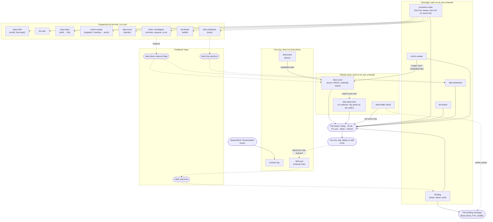

# Skill ecosystem flow

A high-level picture of how the marcketplace skills run, read top to bottom by cadence:
the overnight scheduled runs, then the board and your ticks, then the handlers the hub
dispatches on those ticks, then the things you run yourself, then the weekly jobs, then
the feedback loops. Skill names below are the repo skills in
`plugins/marcketplace/skills/`.

Since 1.1.0 there is one tick rule on the whole board: **a tick means "yes, do it"**. The
Router acts on every tick; the Briefing only closes lines and reports. Nothing on the
board is an FYI, and nothing ever sends a message on your behalf.

Solid arrows are a write or a direct hand-off. Dotted arrows mean the hand-off waits for
a later run: a tick reaching the hub on its next scheduled run, or something one run
leaves for another to pick up. The overnight skills are separate scheduled routines, not
a chain; the order shown is the conventional one, and each runs on whatever cron you gave
it.

Three hand-offs wrap from a later band back to an earlier one and aren't drawn as
arrows, to keep the diagram acyclic:

- **Your tick → `proactive-router`.** The hub reads the board fresh on its next run,
  including whatever you ticked, edited, deleted or added.
- **`idea-scout`'s label → `idea-wireframe`.** Scout sets `investigated`; wireframe finds
  it by JQL on its own next run.
- **`session-log`'s notes → `kb-dream`.** Dream reads recent `Sessions/` notes as one of
  its inputs on its next run.

## Legend

- **Bands, top to bottom**: the overnight schedules → the board, your tick and the one
  message → handlers the hub dispatches → things you run yourself or that a hook kicks
  off → the weekly jobs → the loops that feed back into the system.
- **Solid arrow**: a write, or a hand-off within the same run.
- **Dotted arrow**: a hand-off picked up on a later scheduled run rather than acted on
  immediately.
- The **board** node stands in for the shared surface (one chat canvas by default) and
  its five sections. The **message** node is the one post the plugin sends; every other
  skill's run lands in its Runs block from `state.runs`. The tracker, the knowledge base
  and the state document aren't drawn as nodes; every skill that touches them is
  described in `README.md` and each skill's own `SKILL.md`.

## What a tick does, by line

| Line | Tag | On tick |
|---|---|---|
| A swept candidate (email, ticket, note, summary, to-do) | `pr:` | dispatched to its handler, or an inline action |
| A find from the action sweep | `sweep:` | drafted (first tick), then pushed (second tick on the fresh line) |
| An overdue item | `rb:` | `inline:investigate` |
| A term to add to the glossary | `term:` | `inline:promote`; the line is removed, never logged |
| A curation task | `dream:` | `kb-dream` `settle` |
| A red health score | `shc:` | queued; you run `skill-eval` |
| An option under an idea's decision | `<key>/d…`, `<key>/q…` | `idea-scout` `decide` records it in the note |
| Keep, rework or drop a wireframe | `<key>/w-…` | `idea-wireframe` `react`; a rework requeues the idea |
| Refresh a parked idea that moved | `<key>/r` | `inline:requeue` |
| Your own To-do | (none) | done; briefing closes it |

## Known gaps

- **`idea-deep-dive` still has no selector.** It runs on its own schedule but nothing in
  the code picks which idea it works on; the key comes from the caller. Deliberately left
  as is in this release (the redesign plan's constraints). Its forks now reach the board
  as option groups, so a decision on its output does land in the note.
- **The migration is one-way and runs once.** The first `briefing` run under 1.1.0
  rewrites the board into the five-section layout; every other skill waits for it. A
  board that can't be read as either layout stops briefing with a fallback post rather
  than a guess (`skills/briefing/references/migration.md`).
- **The eval cases for dispatching handlers grade the hub's payload, not the handler.**
  The new `proactive-router` cases accept either a completed dispatch or a documented
  "could not resolve a tool category" sub-line, because the mock servers cover chat and
  the state document only.
