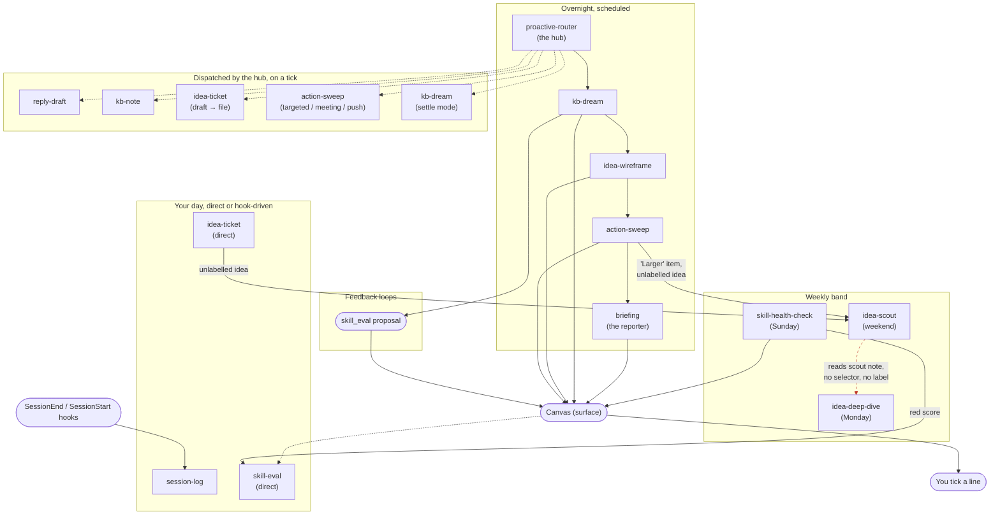

# Skill ecosystem flow

A high-level picture of how the marcketplace skills are designed to run, read top to
bottom by cadence: the overnight scheduled run, then your working day, then the weekly
jobs, then the feedback loops that tune the system. Skill names below are the repo
skills in `plugins/marcketplace/skills/`.

Solid arrows are a write or a direct hand-off. Dotted arrows mean the hand-off isn't
immediate — a tick on the surface reaching the hub, or something one run leaves for a
later one to pick up. Red dashed arrows mark a link that's designed but not actually
wired up yet; see **Known gaps** below.

Three hand-offs wrap from a later band back to an earlier one, and aren't drawn as
arrows — drawing them would turn the whole diagram into a cycle and wreck the
top-to-bottom reading. Take the `Canvas` and `You tick` nodes as feeding the top of the
next overnight run:

- **Your tick → `proactive-router`.** The hub reads the canvas fresh on its next
  scheduled run, including whatever you ticked.
- **`idea-scout`'s label → `idea-wireframe`.** Scout sets `investigated`; wireframe finds
  it by JQL on its own next run, not that same night.
- **`session-log`'s notes → `kb-dream`.** Dream reads recent `Sessions/` notes as one of
  its inputs on its next run.

## Legend

- **Bands, top to bottom**: overnight schedule → the surface and your tick → handlers the
  hub dispatches → things you run yourself or that a hook kicks off → the weekly jobs →
  the loops that feed back into the system.
- **Solid arrow**: a write, or a hand-off within the same run.
- **Dotted arrow**: a hand-off picked up on a later scheduled run rather than acted on
  immediately.
- **Red dashed arrow**: designed but not actually wired up — see below.
- Three hand-offs wrap from a later band back to an earlier one and aren't drawn as
  arrows at all, to keep the diagram acyclic — see the note above the diagram.
- The **Canvas** and **You tick** nodes stand in for the shared surface (one chat canvas
  by default). Jira, the vault and the shared state document aren't drawn as nodes; every
  skill that touches them is described in `README.md` and each skill's own `SKILL.md`.

## Known gaps

- **`idea-deep-dive` has no selector and writes no label.** It runs on its own schedule
  but nothing in the code picks which idea it works on, and it never sets a label that
  something else could wait on. It reads the note `idea-scout` wrote, but nothing gates
  `idea-wireframe` on it finishing. Drawn here as a side branch off `idea-scout`, not a
  step between scout and wireframe. See `plugins/marcketplace/skills/idea-deep-dive/SKILL.md`.
- **The "Ideas: decisions for you" section has two owners.**
  `plugins/marcketplace/shared/surface-protocol.md` has `briefing` closing a ticked line
  in that section, but `idea-scout`'s own `SKILL.md` has it settling ticked lines itself
  on its next run. Both can't be right.
- **Version mismatch.** `plugins/marcketplace/plugin.json` reports `0.1.0`; `CHANGELOG.md`
  reports `1.0.0`. Doesn't affect the flow, but worth fixing alongside this.
